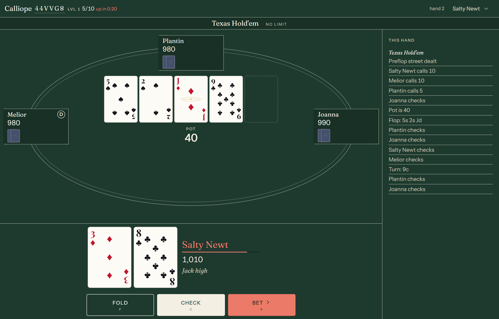
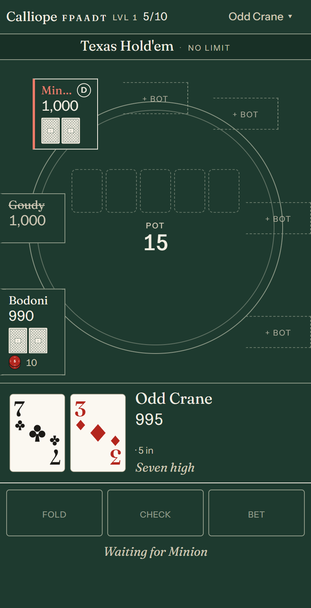
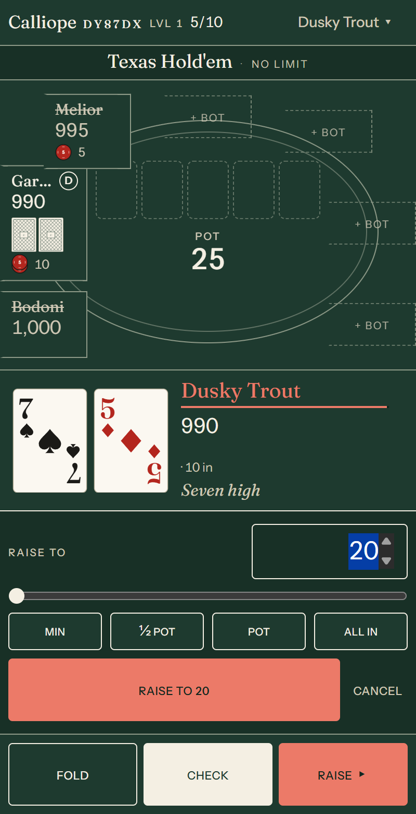
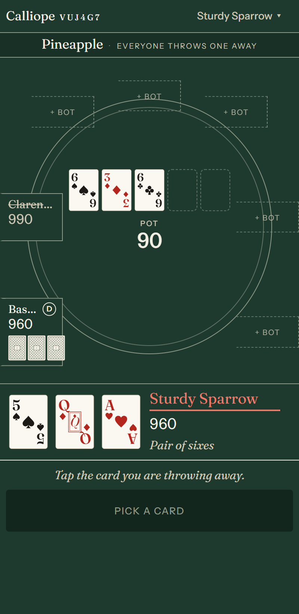
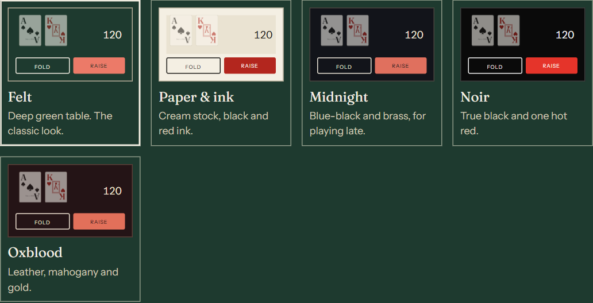
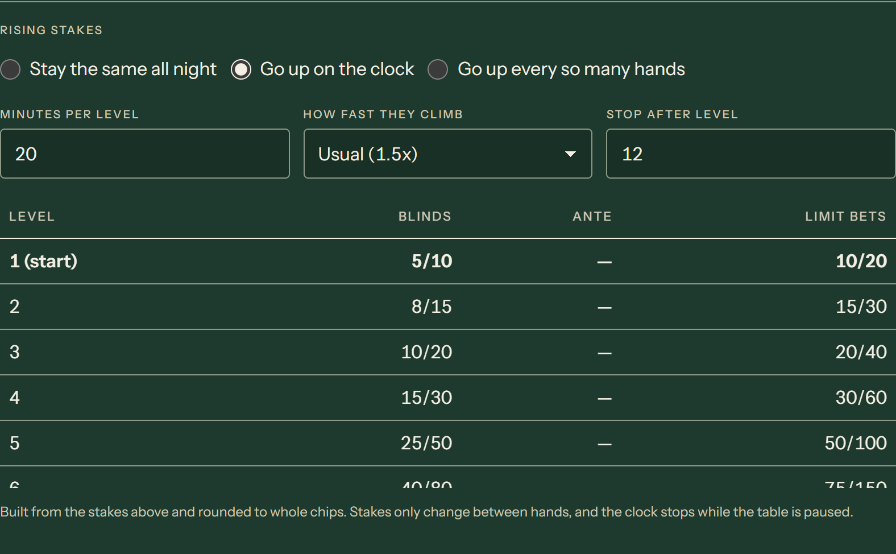
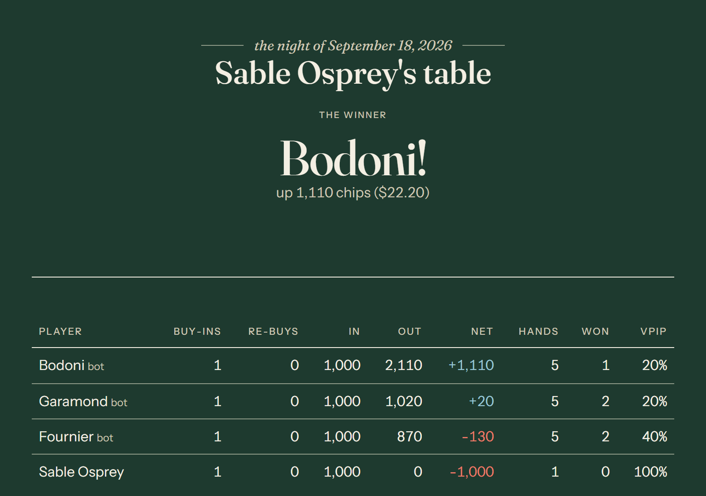

# Calliope Poker

Self-hosted poker for a table of friends. Room codes and join links, dealer's choice between Hold'em, Omaha, Pineapple, seven-card stud, five-card stud and five-card draw, buy-ins and re-buys, blinds and antes that climb on a schedule, rule-based bots, five themes, and a printed night report at the end.

No accounts. Everyone gets a name for the evening and a five-word ticket that brings their record back another night.




Your own hand is always the loudest thing on the table, and the game being
played is named across the top, because in dealer's choice it changes every
hand.

<table>
<tr>
<td width="33%"></td>
<td width="33%"></td>
<td width="33%"></td>
</tr>
<tr>
<td align="center"><em>A phone is a first-class seat</em></td>
<td align="center"><em>Raise with presets or the slider</em></td>
<td align="center"><em>Tap a card to throw it away</em></td>
</tr>
</table>

<table>
<tr>
<td width="50%"></td>
<td width="50%"></td>
</tr>
<tr>
<td align="center"><em>Five themes, each swatch drawn in its own colours</em></td>
<td align="center"><em>Blinds and antes climb on a schedule you can see</em></td>
</tr>
</table>

<p align="center">
  
</p>

<p align="center"><em>Every night ends with a printed report: who won, what everybody put in and
took out, the biggest pot and the luckiest draw.</em></p>

## What this is, and is not

Calliope is a scorekeeper and a dealer for a private game among people who already
know each other. It handles **no money**. There is no cashier, no deposits and no
payment processing of any kind, and none is planned.

Chips are just numbers. The one place real currency appears is the optional
"a buy-in is worth" setting, which does nothing except print a figure next to the
chip counts in the end-of-night report, the way somebody would write it on a
napkin. Settling up happens between people, away from the software.

Rooms are private and unlisted, reachable only by a six-character code or the
link. Anyone who runs a public instance is responsible for it, including for
whatever gambling law applies where they and their players live. Running a home
game for friends and operating a gambling service are very different things in
most places.

## Run it

```
cp .env.example .env    # set a password and a secret
docker compose up -d
```

Open http://localhost:8080. Three containers: Postgres, Redis, and the app, which
serves the web client and the API.

To play with other people, give them the address this machine has on your network,
like `http://192.168.1.50:8080`. The room code, the join link and the QR code in
the lobby are all built from the address the browser is already on, so whatever
works for you works for the people you send it to. Set `PUBLIC_URL` only if guests
reach the server somewhere else than you do, such as through a proxy or a domain.

## Keeping the server to yourself

By default anybody who can reach the server can open a table on it. If yours is
on the open internet, set a host key so only you can:

```
HOST_KEY=some-long-random-string
```

Put it in `.env` (docker compose passes it through) and restart. Then, once, open
the site, choose **I run this server** on the landing page and enter the key. That
identity can open tables from then on, and the permission follows your five-word
ticket to any other device.

Everyone else is unaffected: they can make a name, follow your room link or type
your room code, sit down and play. They just cannot open tables of their own. The
check is enforced on the server, not just hidden in the interface.

To generate a key:

```bash
openssl rand -base64 24
```

With no `HOST_KEY` set the server logs a warning at startup so an open instance
is never a surprise. Creating identities is rate limited either way, to 30 per
address per hour.

## Starting over

All state lives in the two containers: Postgres holds identities, finished nights
and hand history; Redis holds the tables that are in play. The app also keeps live
tables in memory, so **restart it after clearing Redis** or it will just write them
back.

**Wipe everything.** Deletes the volumes, so every identity, ticket, night and
hand is gone for good. Postgres rebuilds its schema on the next start.

```bash
docker compose down -v
docker compose up -d
```

**Wipe the data but keep the containers.** Same effect, quicker.

```bash
docker compose exec postgres psql -U calliope -d calliope   -c "TRUNCATE users, sessions, rooms, room_players, hands, hand_players RESTART IDENTITY CASCADE;"
docker compose exec redis redis-cli FLUSHALL
docker compose restart app
```

**Just clear the tables in play, keeping people and past nights.** Useful if a room
is wedged.

```bash
docker compose exec redis redis-cli FLUSHALL
docker compose restart app
```

After a full wipe everyone's five-word ticket stops working, because the
identities it pointed at are gone. If you use a `HOST_KEY`, claim it again with
**I run this server** the first time you visit.

To check what you have before deciding:

```bash
docker compose exec postgres psql -U calliope -d calliope -c   "SELECT (SELECT count(*) FROM users) AS people, (SELECT count(*) FROM rooms WHERE ended_at IS NOT NULL) AS nights, (SELECT count(*) FROM hands) AS hands;"
```

## Develop

Requires Node 22+ and Docker (for Postgres and Redis).

```
npm install
docker compose up -d postgres redis   # published on localhost:5432 and :6379
npm run dev:server                    # http://localhost:3000, restarts on change
npm run dev:web                       # http://localhost:5173, proxies /api and /ws
npm test                              # engine, bot, shared and server tests
npm run typecheck

# Browser walkthroughs, against a running server (see CHANNEL in each file)
npm run e2e --workspace @calliope/web                  # every screen, screenshotted
npm run e2e:dealers-choice --workspace @calliope/web   # regression guard
npm run e2e:draw-games --workspace @calliope/web       # Pineapple and five-card draw
npm run e2e:lobby-and-sharing --workspace @calliope/web # unsaved settings, cancelling, the join link
```

The walkthroughs open tables, so against a host-only server pass the same
`HOST_KEY` in the environment and they will unlock themselves first.

```
```

The server reads `DATABASE_URL`, `REDIS_URL`, `PORT`, `SECRET`, `HOST_KEY` and `PUBLIC_URL` from the environment; `.env.example` documents each one. In production it also serves `packages/web/dist`.

## How it is put together

```
packages/engine   pure, deterministic poker engine: cards, evaluator, betting, pots, variants, table reducer
packages/shared   zod schemas for settings and the websocket protocol; view types
packages/bots     rule-based bots (tight, loose, aggressive, calling station)
packages/server   Fastify + websockets, identity, rooms, Redis snapshots, Postgres history
packages/web      Vite + React client, hand-drawn SVG cards and chips, five themes
docs/design.md    the visual system the client is built against
docs/variants.md  how to add a poker variant
docs/protocol.md  HTTP and websocket reference
```

The night's clock counts playing time rather than wall time, so pausing the table stops both the time limit and the blind schedule, and a server restart mid-night brings the room back paused rather than burning the clock.

The engine is a reducer: `reduce(state, event)` returns a new state and a list of effects. It never does I/O, so every hand can be replayed from its event log and every rule has a unit test. The server holds each room in memory, writes a snapshot to Redis after every change, and restores rooms on start, so a restart mid-hand is survivable. Finished hands and night reports go to Postgres for statistics.

## Adding a game

See `docs/variants.md`. A variant is mostly a list of streets; the engine handles forced bets, betting rounds, side pots and showdown.

## License

MIT. See `LICENSE`.

The project also redistributes the EFF short wordlist (CC BY 4.0) and two fonts
under the SIL Open Font License. Those are credited in `NOTICE.md`, with the full
font license texts in `licenses/`. Keep both files with the code if you fork or
repackage it.
